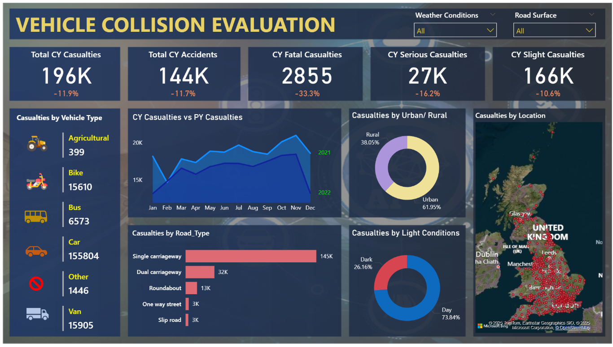

# 🚧 Vehicle Accident Reporting Dashboard

A data visualization project that analyzes UK road accident data using **Power BI** to identify patterns, monitor safety trends, and provide actionable insights for decision-makers.

## 📊 Project Overview

This project focuses on building an interactive **dashboard from scratch** to analyze vehicel accident statistics. The dashboard allows users to explore accidents by severity, vehicle type, time of day, and location. It's designed to simulate a real-world reporting system for use by public safety departments and city planners.

## 🎯 Objectives

* Visualize trends in road accidents over time
* Track the number and severity of casualties
* Identify high-risk locations and vehicle types
* Enable data-driven decisions for safety improvement

## 🛠️ Tools & Technologies

* **Power BI** – Data visualization and dashboard creation
* **DAX** – For calculated fields and performance metrics
* **Microsoft Excel** / CSV – Raw data pre-processing

## 📁 Features

* **Year-over-Year Comparison** of accident and casualty rates
* **Dynamic Filters** by severity, time of day, vehicle type, and region
* **Interactive Maps** to locate accident hotspots
* **KPI Cards** showing current totals and percentage changes
* **Monthly Trends** to analyze seasonal patterns

## 📌 Key Metrics Tracked

* Total Accidents
* Casualties (Fatal, Serious, Slight)
* Casualties by Vehicle Type
* Accidents by Road Type and Lighting Conditions
* Monthly Accident Trends

## 📈 Impact & Usage

Although based on publicly available data, the dashboard simulates how safety authorities or local governments could:

* Monitor road safety trends in real time
* Allocate resources (e.g., traffic control, street lighting) effectively
* Launch awareness campaigns targeting high-risk groups

## 🗂️ Dataset

* Source: [UK Government Open Data Portal](https://data.gov.uk/dataset/road-accidents-safety-data)
* Format: CSV files (Accidents, Vehicles, Casualties)

## 🧠 Learning Outcomes

* Built a complete end-to-end BI solution
* Gained hands-on experience with DAX and Power BI features
* Learned to translate raw data into business-relevant insights

## 🧑‍💻 Author

**Eyasu Berhane Habte**
🔗 [LinkedIn](https://www.linkedin.com/in/eyasu-berhane-habte/) | 📧 [eyasuberhanehabte@gmail.com](mailto:eyasuberhanehabte@gmail.com)

## Final Dashboard 

---
